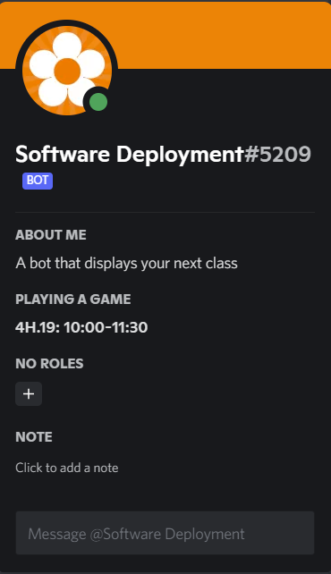

# Schedule Bot

Welcome to the documentation for ScheduleBot - A bot created display when your next class is scheduled.

## Table of Contents

1. [Project Overview](#project-overview)
2. [Prerequisites](#prerequisites)
3. [Getting Started](#getting-started)
   - [Installing Dependencies](#installing-dependencies)
   - [Configuring .env](#configuring-env)
   - [Starting the Bot](#starting-the-bot)
4. [Usage](#usage)
5. [Contributing](#contributing)
6. [License](#license)

## Project Overview

This Discord.js bot is designed to display information about your upcoming classes in school.



## Prerequisites

Before you begin, ensure you have the following installed:

- [Node.js](https://nodejs.org/)
- [npm](https://www.npmjs.com/) (Node Package Manager)
- [Git](https://git-scm.com/) (Optional, but recommended for version control)

## Getting Started

### Installing Dependencies

1. Clone this repository to your local machine:

   ```bash
   git clone https://github.com/your-username/your-discord-bot.git
   ```

2. Navigate to the project directory:

   ```bash
   cd ScheduleBot
   ```

3. Install the project dependencies:

   ```bash
   npm install
   ```

## Configuring .env

Create a .env file in the root directory of your project and fill in the following values:

```env
CLIENT_TOKEN = your_bot_token_here
```

Replace your_bot_token_here with your Discord bot token

## Starting the Bot

Run the following command to start your bot:

```bash
npm start
```

Your Discord bot should now be online and ready to respond to commands.

## Usage

This bot does not accept any form of user input, it reads everything from the json_files directory.

## Contributing

If you'd like to contribute to this project, please create an issue describing what you are changing and follow that with a pull request.

## License

Anyone is free to use or modify this source code.
